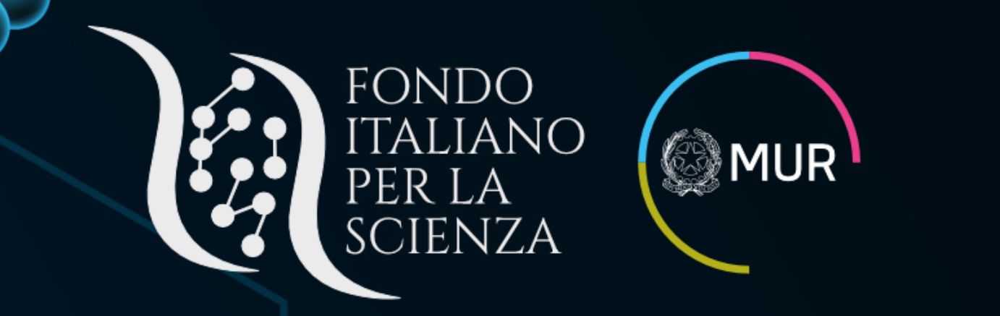
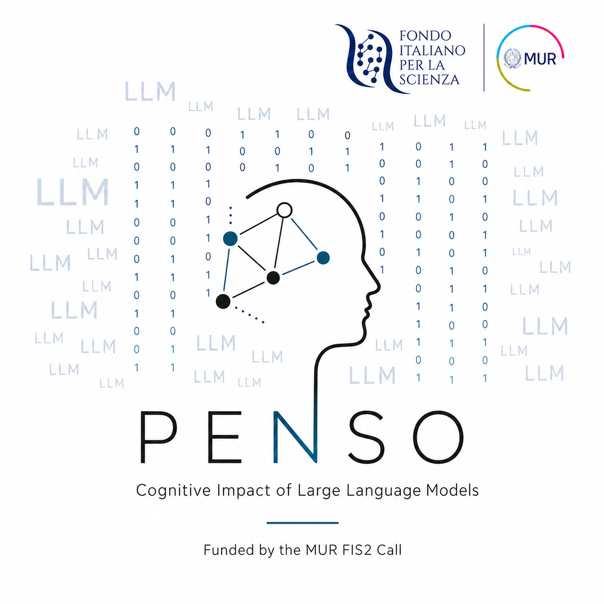

# MyMentorLLM

Analysis code for MyMentorLLM, a multimodal voice- and text-based deliberate-practice environment used to generate **2,100 simulated Cognitive Behavioural Therapy (CBT) training sessions**, with **65,100 dialogue turns** and **263.4 hours of speech**.

This repository contains `reproduce_paper.ipynb`, which reproduces all analyses, analysis figures, tables and in-text results reported in the paper using the public Hugging Face dataset and the included human-reference data.

If you use this work, please cite [arXiv:2607.25667](https://arxiv.org/abs/2607.25667) (see [Citation](#citation)).

[](https://arxiv.org/abs/2607.25667)
[](https://huggingface.co/datasets/RodolfoRizzi/MyMentorLLM-dataset)
[](LICENSE)

<p align="center">
  
  
</p>

Psychotherapy training needs repeated practice and feedback from experienced supervisors, but qualified professionals have limited time to offer it. MyMentorLLM is a voice- and text-based deliberate-practice environment used here to generate 2,100 complete CBT sessions. Each includes three LLM roles:

- a **patient** with major depressive (MDD), generalised anxiety (GAD) or borderline personality disorder (BPD), informed by the vignettes in *DSM-5-TR Clinical Cases* (Barnhill, 2023);
- a **therapist-in-training**, who conducts the session;
- a **mentor**, acting as an **expert supervisor**, who scores the trainee on the 11-item Cognitive Therapy Rating Scale (CTRS; Young & Beck, 1980) and runs a structured debrief on diagnosis and symptoms.

| | |
|---|---|
| Sessions | 2,100 |
| Dialogue turns | 65,100 |
| Spoken therapy | 263.4 hours across 900 audio sessions |
| Audio clips | 27,900 FLAC, 20.3 GiB, in Parquet and as separate files |
| Language | Italian |
| Models | Gemini 3.1 Live, Gemini 3.5 Flash (supervision only), Gemma 4 (12B, E2B), Qwen 3.5 9B, Qwen 3.6 35B |

> **Content notice.** The conversations are model-generated: no real patients took part and the files contain no personal data. Because the personas are clinically grounded, the transcripts may contain clinically sensitive material, including expressions of suicidal ideation and self-harm.

## Reproducing the analysis

**1. Environment** (Python 3.11):

```bash
python -m venv .venv
source .venv/bin/activate        # macOS / Linux
.venv\Scripts\activate           # Windows
pip install -r requirements.txt
```

**2. Data.** Nothing to download: by default the notebook streams the dataset from Hugging Face,
and no account or access request is required. The first cell of `reproduce_paper.ipynb` selects
the source:

```python
DATA_DIR = "hf://datasets/RodolfoRizzi/MyMentorLLM-dataset/data"  # default: read from Hugging Face
# DATA_DIR = "data"                                               # offline: local copy, see below
```

To work offline, fetch the two tables the analyses use once (they land in `./data/`) and swap the
comment:

```bash
hf download RodolfoRizzi/MyMentorLLM-dataset --repo-type dataset --local-dir . \
    --include "data/mentor_sessions.parquet" "data/therapy_turns.parquet"
```

The dataset is at
[huggingface.co/datasets/RodolfoRizzi/MyMentorLLM-dataset](https://huggingface.co/datasets/RodolfoRizzi/MyMentorLLM-dataset)
and all of its fields are documented in
[`docs/dataset_schema.md`](https://huggingface.co/datasets/RodolfoRizzi/MyMentorLLM-dataset/blob/main/docs/dataset_schema.md)
there.

**3. Run.** Open `reproduce_paper.ipynb` and run all cells, or run it headless:

```bash
pip install ipykernel && python -m ipykernel install --user --name mymentorllm
python -m nbconvert --to notebook --execute \
    --ExecutePreprocessor.kernel_name=mymentorllm \
    --output results/reproduce_paper.executed.ipynb reproduce_paper.ipynb
```

All outputs, including the executed notebook, are written to `results/`. Every cell asserts its
result against the published value. For the EmoAtlas part the total runtime depends on
the available hardware.

## Reproduced outputs

| Paper result | Output in `results/` | Validation |
|---|---|---|
| Table 1 — mean CTRS scores by item and total | `Table1_ctrs_means.csv` | 104 values |
| Fig. 2 — emotional flowers | `Fig2_emotional_flowers/*.png` | Supplementary Table 1 |
| Fig. 3a — CTRS score distributions vs human | `Fig3a_ctrs_score_distributions_vs_human.pdf` | — |
| Fig. 3b,c — CTRS totals by disorder and condition | `Fig3bc_ctrs_total_by_disorder_and_condition.pdf` | — |
| Fig. 4a — A_I, A_F, c, A_S | `Fig4a_diagnosis_and_symptom_accuracy.csv` | 28 values |
| Fig. 4b — beneficial vs harmful feedback | `Fig4b_feedback_beneficial_vs_harmful.pdf` | — |
| Fig. 4c,d — confusion matrices | `Fig4cd_diagnosis_confusion_before_after_feedback.pdf` | — |
| Fig. 4e,f — diagnosis transitions | `Fig4ef_diagnosis_transitions_after_feedback.pdf` | — |
| Fig. 5a,b — symptom identification | `Fig5a_...pdf`, `Fig5b_...pdf` | — |
| Supplementary Table 1 — EmoAtlas z-scores | `SuppTable1_emoatlas_zscores.csv` | 384 values |
| Results reported in the main text | — | 16 values |

Fig. 1 is a study overview illustration rather than an analysis and is therefore not reproduced here.

## Repository structure

```text
MyMentorLLM/
├── reproduce_paper.ipynb      # Reproduces all analyses, figures, and reported results
├── analysis.py                # CTRS, diagnosis, and symptom analyses
├── figures.py                 # Figures 3–5
├── emotions.py                # EmoAtlas analysis and Fig. 2
├── reference/
│   ├── goldberg2020_ctrs_*.csv    # Human CTRS reference data (Goldberg et al., 2020)
│   ├── hope_zscores.csv           # HOPE human baseline
│   └── paper_*.csv                # Published values used for validation
├── assets/                    # Static assets used by the repository
├── requirements.txt           # Python dependencies
├── CITATION.cff
├── LICENSE
└── README.md
```

## Conditions

A condition is `model_patient_therapist` × `modality`: 7 conditions of 300 sessions each, in three interaction modes. These are the labels used throughout the tables and figures.

| Model | `modality` | Interaction mode |
|---|---|---|
| `gemini-3.1-flash-live-preview` | `audio` | Native speech-to-speech |
| `gemma-4-12B-it`, `gemma-4-e2b-it` | `audio` | Speech generated with the OmniVoice TTS engine |
| `gemma-4-12B-it`, `gemma-4-e2b-it`, both Qwen models | `text` | Text only |

## Dataset generation

1. **Setup.** Each session was assigned a model, a `modality` (`text` or `audio`), a disorder and a patient persona. The trainee and mentor prompts were the same in every condition.
2. **Therapy.** The patient and the trainee ran as independent model instances and exchanged 31 turns, in text or voice.
3. **Supervision.** The mentor read the transcript, scored the trainee on the eleven CTRS items and ran the diagnostic and symptom debrief.

Only sessions with all 31 turns and a valid structured mentor output were kept. The procedure, prompts, design and validation are in the [accompanying paper](https://arxiv.org/abs/2607.25667).

## HOPE (human baseline of Fig. 2)

The HOPE corpus (Malhotra et al., WSDM 2022) is distributed by its authors on request
(<https://github.com/LCS2-IIITD/SPARTA_WSDM2022>), so its text is not included; its 16 z-scores are.
With access to the 212 session CSVs, recompute them by installing the English spaCy model and setting
`HOPE_DIR` in the EmoAtlas cell:

```bash
pip install https://github.com/explosion/spacy-models/releases/download/en_core_web_lg-3.8.0/en_core_web_lg-3.8.0-py3-none-any.whl
```

## Scoring rules

- **Diagnosis:** exact scoring. A response is correct only if it names the true disorder alone; hedged (`Multiple`) responses and refusals are scored as incorrect. Normalised change is computed as `c = (A_F − A_I) / (100 − A_I)` when accuracy increases and `(A_F − A_I) / A_I` when it decreases (Marx & Cummings, 2007).

- **Symptoms:** each session scores the proportion of its five named symptoms that fall within the true disorder's block of the 35-item list (1–9 BPD, 10–26 MDD, 27–35 GAD). Responses containing any number other than five distinct symptoms receive a score of 0. `A_S` corrects each disorder for chance performance (9/35, 17/35, and 9/35, respectively) and averages across the three disorders.

- **Emotions:** spoken turns are pooled by condition × disorder × role and scored with EmoAtlas (Semeraro et al., 2025) `zscores` using the Italian `it_core_news_lg` model. Values with |z| > 1.96 are treated as significant.

The normalised diagnosis labels (`trainee_q1_dx`, `trainee_q3_dx`), correctness flags, and parsed symptom lists are provided precomputed in the dataset release; see `docs/dataset_schema.md`.

## References

The instruments, reference data and tools this repository depends on:

- American Psychiatric Association (2022). *Diagnostic and Statistical Manual of Mental Disorders: DSM-5-TR* (5th ed., text rev.). American Psychiatric Association Publishing.
- Barnhill, J. W. (2023). *DSM-5-TR Clinical Cases*. American Psychiatric Association Publishing.
- Goldberg, S. B. et al. (2020). The structure of competence: Evaluating the factor structure of the Cognitive Therapy Rating Scale. *Behavior Therapy* **51**, 113-122.
- Malhotra, G., Waheed, A., Srivastava, A., Akhtar, M. S. & Chakraborty, T. (2022). Speaker and time-aware joint contextual learning for dialogue-act classification in counselling conversations. *Proceedings of the Fifteenth ACM International Conference on Web Search and Data Mining (WSDM '22)*, 735-745.
- Marx, J. D. & Cummings, K. (2007). Normalized change. *American Journal of Physics* **75**, 87-91.
- Semeraro, A. et al. (2025). EmoAtlas: An emotional network analyzer of texts that merges psychological lexicons, artificial intelligence, and network science. *Behavior Research Methods* **57**, 77.
- Young, J. E. & Beck, A. T. (1980). *Cognitive Therapy Scale: Rating Manual*. Unpublished manuscript, Center for Cognitive Therapy, University of Pennsylvania, Philadelphia, PA.

The human CTRS reference data in `reference/` is taken from Goldberg et al. (2020); the CTRS
itself is the eleven-item scale of Young & Beck (1980).

## Use restrictions

The dataset must not be used to provide clinical advice, support clinical decision-making, or diagnose real individuals. Its contents must not be presented as records of real patients. Model-generated feedback and CTRS scores are not expert human clinical judgments.

## Citation

> Rizzi, R., Grecucci, A., & Stella, M. (2026). MyMentorLLM: A psychotherapy GenAI environment with multimodal voice/text patients, trainees and experts for deliberate practice. *arXiv preprint* arXiv:2607.25667.

```bibtex
@article{rizzi2026mymentorllm,
  title   = {MyMentorLLM: A psychotherapy GenAI environment with multimodal
             voice/text patients, trainees and experts for deliberate practice},
  author  = {Rizzi, Rodolfo and Grecucci, Alessandro and Stella, Massimo},
  journal = {arXiv preprint arXiv:2607.25667},
  year    = {2026}
}
```

## Acknowledgements

This work was part of the PENSO project, supported by the Ministero dell'Università e della Ricerca (MUR) according to Decreto N. 23178 of 10 December 2024 (Bando FIS 2). The authors acknowledge support from CALCOLO, funded by Fondazione VRT, for support with the computational infrastructure simulating the LLMs.

## Licence

The code in this repository is released under the [MIT licence](LICENSE). The dataset it reads is released separately under [CC BY 4.0](https://creativecommons.org/licenses/by/4.0/), with the Gemma flow-down notice in its own `LICENSE`.

## Contact

Issues, corrections and questions: <rodolfo.rizzi@unitn.it> or the [issue tracker](https://github.com/RodolfoRizzi/MyMentorLLM/issues).
